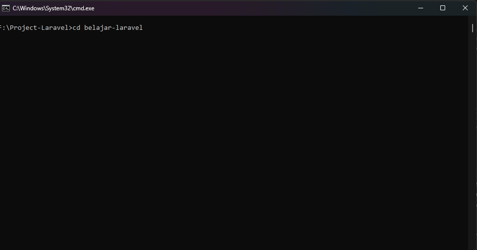

# Persiapan dan Instalasi Laravel

* [Persiapan](#persiapan)
* [Instalasi](#instalasi-laravel)

---

## Persiapan
Sebelum melakukan instalasi Laravel ada beberapa persiapan yang harus dilakukan pada lingkungan development. Hal ini terkait dengan persyaratan minimal sistem yang dibutuhkan oleh Laravel dan instalasi tool-tool pendukung sesuai dengan sistem operasi.

Laravel memiliki beberapa persyaratan sistem yang harus dipenuhi agar bisa berjalan. Perysaratan yang harus dipenuhi antara lain:

* PHP Versi 8.++\
  Agar bisa menjalankan Laravel di lingkungan development maka harus terinstall PHP versi 8.++, karena Laravel versi 10 hanya bisa dijalankan menggunakan PHP versi 8.++.\
  

* MySQL\
  MySQL di sini akan digunakan sebagai manajemen basis data pada project yang akan dikembangkan.\
  

* [Laragon](https://laragon.org/download/index.html) \
  Laragon akan digunakan lingkungan pengembangan, pada laragon sendiri sudah termasuk paket PHP versi 8, dan MySQL.\
  

* [Composer](https://getcomposer.org/) \
  Composer merupakan package manager untuk PHP. Composer sangat diperlukan saat development dengan Laravel. Salah satunya untuk menginstal Laravel akan menggunakan Composer.\
  

* Browser\
  Browser akan digunakan untuk menampilkan hasil project Laravel. Kita bisa menggunakan browser seperti Google Chrome, Mozilla Firefox, Safari, dan lain sebagainya.

## Instalasi Laravel

Setelah selesai melakukan instalasi persiapan agar bisa menjalankan Laravel di lingkungan development. Pada tahap ini sudah bisa memulai instalasi Laravel.

Kita akan menggunakan composer ```create-project``` untuk menginstal Laravel.

Buat folder pada drive dengan nama **Project-Laravel**, pada folder ini nantinya akan kita gunakan untuk menyimpan project Laravel kita seterusnya.

Buka CMD/Command Line atau Terminal yang mengarah ke folder  **Project-Laravel**.\


Tuliskan perintah composer ```create-project``` pada CMD untuk menginstal Laravel.\

```
 composer create-project laravel/laravel belajar-laravel
```

```composer create-project laravel/laravel``` merupakan perintah untuk menginstall Laravel. ```belajar-laravel``` merupakan nama project Laravel kita.


Tekan Enter maka proses instalasi Laravel akan berjalan. Tunggu hingga proses instalasi Laravel sampai selesai.


Setelah proses instalasi Laravel selesai maka akan ada folder baru di dalam folder **Project-Laravel** dengan nama **belajar-laravel**. Folder tersebut merupakan folder project Laravel kita, di dalamnya berisi kerangka kerja yang diperlukan pada saat proses development.

Selanjutnya kita akan menjalankan project Laravel. Tuliskan perintah berikut pada CMD untuk masuk ke folder project **belajar-laravel**.

```
cd belajar-laravel
```



Tekan enter, maka pada CMD akan berpindah ke folder project **belajar-laravel**. Selanjutnya tuliskan perintah di bawah ini pada CMD.

```
php artisan serve
```

Perintah tersebut digunakan untuk menjalankan project laravel. 


Pada CMD akan menampilkan url **127.0.0.1:8000**, url tersebut akan kita gunakan di browser untuk melihat hasil dari project kita.


Apabila pada browser tampil seperti pada gambar di atas, maka kita berhasil menjalankan project Laravel kita.