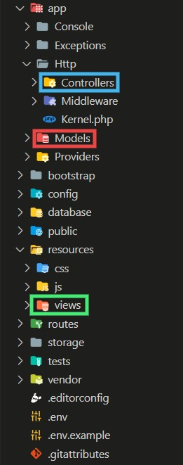

# Konsep MVC di Laravel
* [Konsep MVC](#konsep-mvc)
* [MVC di Laravel](#mvc-di-laravel)

---

## Konsep MVC
MVC atau kepanjagannya *Model View Controller* merupakan sebuah pola pengembagan aplikasi. MVC digunakan untuk pengembangan GUI desktop, tapi kini telah banyak diadopsi oleh framework-framework aplikasi berbasis web. Jika kita mengembangkan aplikasi tanpa pola MVC, kita berkecenderungan untuk mencampur adukkan kode logika kita dengan kode tampilan serta kode untuk mengambil data ke database. Pola MVC  membagi komponen aplikasi kita menjadi 3 bagian yang terpisah namun saling berkaitan, yaitu *Model, View dan Controller*.

1. Model\
  Merupakan komponen dalam aplikasi yang bertanggung jawab mengelola akses langsung dengan sumber data dan logika pengelolaan data.

2. View\
  Merupakan komponen dalam aplikasi yang bertanggung jawab untuk membuat tampilan / interface untuk pengguna. Sumber data didapat dari model yang didapatkan melalui controller. Tidak berinteraksi langsung dengan database. View juga menangkap interaksi dari pengguna yang akan diteruskan ke aplikasi.

3. Controller\
  Merupakan komponen dalam aplikasi yang bertanggung jawab untuk menerima input dan memberikan output, atau dalam dunia web kita lebih mengenal dengan istilah request dan response. Controller bertugas untuk menerima request, kemudian memprosesnya dengan memberikan response baik berupa data atau view berisi data dari model.

## MVC di Laravel
MVC di laravel secara konsep tidak jauh berbeda dengan konsep MVC secara umum. Setiap komponen di MVC telah disediakan folder khusus di project laravel.
1. Controller berada di folder ```app/Http/Controllers```
2. View berada di folder ```resources/views```
3. Model berada di folder ```app/Models```



Pada materi selanjutnya akan mendalami konsep Laravel lebih dalam lagi.